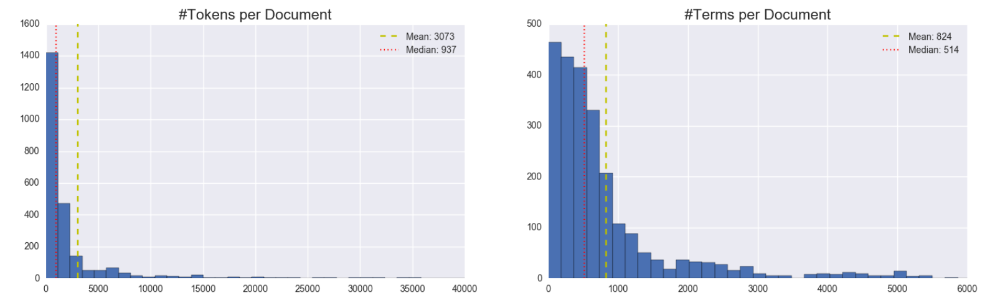
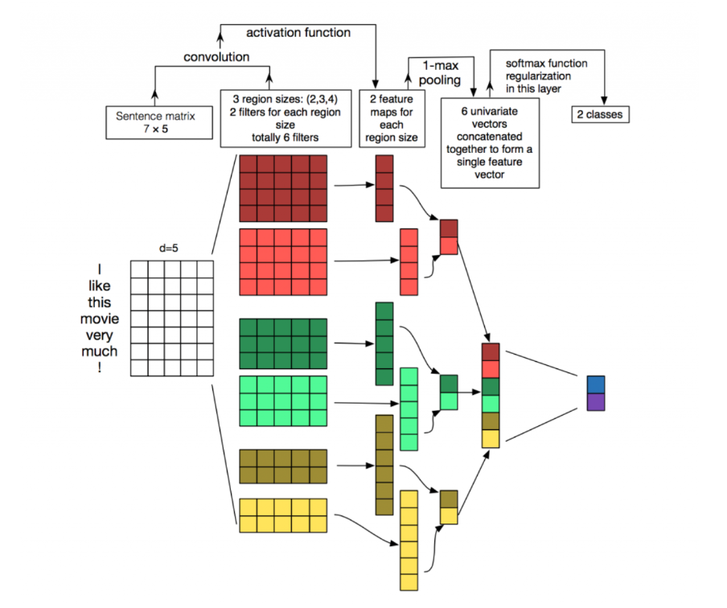

# MIDS-W266-Final-MSY
Repo for W266 NLP final project. Team: Max Shen, Will Monge and Nelson Yao

### Summary

__NOTE: Environment setup__
_For environment setup refer to the [config folder](https://github.com/seriousNel/MIDS-W266-Final-MSY/tree/master/config)_

### Index

* Motivation & Background
* Data, Extraction & Parsing
    * Data Source
    * Extraction
    * Parsing
    * Dependent Variable Construction
* Feature Engineering
    * One Hot Encoding of 8K items
    * Word Embeddings
    * Input Features
* Models
    * Random Forest (_baseline_)
    * CNN
    * Feed-forward
* Results & Conclusion

### Motivation & Background

__GOAL:__ Predict changes in stock price of public companies based on official financial disclosure documents (such as 8K).

Quant investment strategies rely on the numerical information released periodically by publicly traded companies required to release periodically.

Financial documents or SEC filings (such as the 8K) contain a lot of text-heavy data that can also affect market’s opinion.

We plan to create predictive models on stock price movements of publicly traded equities and discover key words/phase applying NLP techniques to extract additional information from unstructured text.

### Data, Extraction & Parsing

#### Data Source

As main data source we used the paper by [_Lee, Surdeanu, MacCartney & Jurafsky_](https://web.stanford.edu/~jurafsky/pubs/lrec2014_stocks.pdf), which introduced text modeling to forecasts companies’ stock price changes (UP, DOWN, STAY) in response to financial events reported in 8K documents.

The authors provide a repository with the data of all S&P500 companies (a total of 1500 companies) during the periods of 2002 and 2012. Of each  company the following data is provided:
* 8-K (size: 1.4 GB)
* EPS (size: 17 MB)
* Price history (size: 100 MB)
* S&P 500 companies list (size: 38 kB)

#### Extraction

The raw data consisted of a folder of 1500 zipped files, each corresponding to one of the S&P500 companies. Each zipped file was a flat text file with all the 8Ks released by that company in a slightly structured manner:
* XML-like tags for enclosing the documents (`<DOCUMENT>...<END OF DOCUMENT>`)
* Meta-data tags at the head of the document: `RELEASE TIME`, `ITEMS` and `TEXT`

With python we programmatically unzipped the files, split into documents and extracted the following features:
* Company
* Timestamp of release
* Human-readable release date
* Items
* Raw text

#### Parsing

From the raw text of the document we had to perform some cleaning tasks, so as to eliminate a few (~10) empty documents (though to either empty text or corrupt tags). The total parsed documents were approximately 195K.

In addition, we had to parse the EPS from the tables in the HTML source, obtaining the Earnings Per Share for each of the companies in the repository.

#### Dependent Variable Construction

From the dataset, we reconstruct stock returns immediately following the release of the 8-K then normalized by subtracting it from S&P 500 performance during the same timeframe.  If the difference is larger than 1%, we labeled it as ‘UP’. If the difference is smaller than -1%, we labeled it as ‘DOWN’.  Anything else will be labeled as ‘STAY’.

For example, suppose Apple’s release it’s 8-K on 04/30/2005 after the market close.  The label is classified as:

If the document release is during market trading hours, then the price difference will be today’s open and today’s close.  If the release is before market trading hours, price difference will be previous close and today’s open.

Ideally we would love to have hourly stock performance right after release of 8-K, but that data is not available so we use close/open price instead.

The purpose of subtracting stock performance from the market performance is to reduce the market’s effects, retaining parts of price moments related to information in the 8-K.

By creating labels this way, stock performance is simplified into a classification problem rather than a regression problem.

### Feature Engineering

#### One Hot Encoding

The items categorizing the type of information discussed within the document were extracted, cleaned, clustered (manually) and converted into a [One Hot Encoding](https://en.wikipedia.org/wiki/One-hot) feature vector.

#### Word Embeddings

We used Stanford's geometric embedding methodology [GloVe](http://nlp.stanford.edu/projects/glove/) (which mainly consists of a Skipgram model with Singular Value Decomposition). The following implementations were used:
* Pre-trained GloVe 100d and 300d based on the Common Crawl (42B uncased tokens, 1.9M vocab)
* Self-trained GloVe word embedding from a vocabulary from the training set.

#### Input Features
The main features were extracted from the pure text. For this several symbol and stopword removal was used. We experimented by changing the size of the stopword list and obtained better results as we increased the set of stopwords, however no sensitivity testing was performed. Future steps could include generating a TF-IDF / text-PCA to obtain the key terms from the documents.

For the final feature set we used two different approaches:
* A Bag of Words approach in which the count of all (non-stopword) terms using scikit-learn’s CountVectorizer implementation. This approach assumes that the order of the words is not relevant for the classification task at hand. The rationale behind this could be that the vocabulary of this documents is more technical and there is a differentiation between negative and positive terms, with limited use of negation modifiers.
* Ordered stream of words (with an additional stopword removal). In order, to capture the order of words we also implemented a stream of words feature set.

### Exploratory Data Analysis

We performed a series of explorations on document length, term frequency, number of documents, and similar traits to explore the variability of the language used in these documents.

The following figure shows the distribution of token and term count per document, across all companies. The figures show the clear power law that the tokens follow, however, the less steep decrease in the distribution of the terms suggests that the terms being used are not completely similar to natural language, and have a significant amount of repetition (the vocabulary being more compact and reduced)

The analysis suggested that there existed a significant amount of variability across different companies in terms of documents released and length of documents, as the following figure shows:

Given this finding we considered generating one model per company, but the high number of companies (some of which with a low document count) and given our initial motivation, we decided it would be better to generate a one-for-all model. Time permitting, some explorations could be made to create a segmentation in the companies (e.g. by industry) with more specialized models that could better fit to the idiosyncrasies discussed.

### Models

__Model Assessment:__
By converting stock performance into three buckets, predicting stock return became a classification problem. To benchmark against the original Stanford paper, the key metric to assess performance is accuracy of class predictions.

As evaluation metrics we used the accuracy (as % of correctly predicted) as well as the [softmax cross-entropy](https://www.tensorflow.org/api_docs/python/nn/classification#softmax_cross_entropy_with_logits) between the logit predictions and the labels.

__Train/Development/Test Split:__
We split the dataset based using a time based approach. Data prior to 2009 was used to training.  Data between 2009 and 2010 was used for development set and data after 2011 was used for testing. The idea was to avoid training on events/phases occurred after the test set (i.e., bail-out, Lehman Brothers, etc.)

#### Random Forest (_Baseline Model_)
We took the following steps to engineer the features used for random forest modeling:
1. Lemmatizing the corpus
2. Using scikit-learn to generate count vectorizers
3. Finding the top 3000 word count variables most correlated with the labels using univariate statistical tests
4. Using non-negative matrix factorization to reduce the dimension of the count matrices 100

The resulting matrix of dimension 100 was used as the input to a random forest that is composed of 2000 tree.

After the model is trained, the random forest is tested on the test set. The accuracy of the model is 52.5% and the f1-score was 51.2%. The highest accuracy achieved in Lee et al was 55.5%.

####  CNN
Discussions with course instructors led us to implement convolution neural network, a type of neural network models that is popular for image recognition with applications in NLP as well.   We adapt the implementation from Zhang, Y., & Wallace, B. (2015). A Sensitivity Analysis of (and Practitioners’ Guide to) Convolutional Neural Networks for Sentence Classification and leveraging examples from blog of Danny Britz.

The CNN implementation uses word embedding as input instead of a sparse word count matrix.  Word embedding is of dimension: number of words by embedding size.  Number of words is maximum number of words to be used from each financial document.  Due to resource constraint, we control this number to be between 1000 to 3500 words.  For each financial document, we first parsed the paragraph then feed the words into embedding matrix one by one until the number of words reached the maximum limit.

Similar to Figure 1, we applied 3 filters then applied max-pooling to the results of each filters.  The results of max-pooling combined with a vector of numerical features (earning surprises) became the inputs to the softmax function.  Our implementation is slightly different from Figure 1 in 1). Out label has three classes 2). A L2 loss penalty was used for regularization.

_Source: Zhang, Y., & Wallace, B. (2015)_

As filters with various sizes scanned through the embedding matrix, the filters they were able to pick up phases and short sentences as features.  The idea is similar to n-grams model but more efficient to compute than n-grams.

Here are summary of what we learnt from working with CNN:
CNN converged to optimal results really fast; continue trainings did not seem to improve the model significantly.
Smaller filter sizes tended to work better than larger filter sizes.
Increase training data and embedding size improved accuracy but only to a certain point.
Increased L2 loss improved results as CNN sometimes overfitted training data.
With 170K records for training set, vocab size of , and 2000~3500 words per record, the training process becomes very slow

#### Feed-Forward

