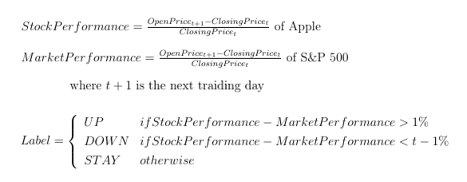

# MIDS-W266-Final-MSY
Repo for W266 NLP final project. Team: Max Shen, Will Monge and Nelson Yao

### Summary

__NOTE: Environment setup__
_For environment setup refer to the [config folder](https://github.com/seriousNel/MIDS-W266-Final-MSY/tree/master/config)_

### Index

* Motivation & Background
* Data, Extraction & Parsing
    * Data Source
    * Extraction
    * Parsing
* Feature Engineering
    * One Hot Encoding of 8K items
    * Word Embeddings
* Models
    * Random Forest (_baseline_)
    * CNN
    * Feed-forward
* Results & Conclusion

### Motivation & Background

__GOAL:__ Predict changes in stock price of public companies based on official financial disclosure documents (such as 8K).

Quant investment strategies rely on the numerical information released periodically by publicly traded companies required to release periodically.

Financial documents or SEC filings (such as the 8K) contain a lot of text-heavy data that can also affect market’s opinion.

We plan to create predictive models on stock price movements of publicly traded equities and discover key words/phase applying NLP techniques to extract additional information from unstructured text.

### Data, Extraction & Parsing

#### Data Source

As main data source we used the paper by [_Lee, Surdeanu, MacCartney & Jurafsky_](https://web.stanford.edu/~jurafsky/pubs/lrec2014_stocks.pdf), which introduced text modeling to forecasts companies’ stock price changes (UP, DOWN, STAY) in response to financial events reported in 8K documents.

The authors provide a repository with the data of all S&P500 companies (a total of 1500 companies) during the periods of 2002 and 2012. Of each  company the following data is provided:
* 8-K (size: 1.4 GB)
* EPS (size: 17 MB)
* Price history (size: 100 MB)
* S&P 500 companies list (size: 38 kB)

#### Dependent Variable Construction

From the dataset, we reconstruct stock returns immediately following the release of the 8-K then normalized by subtracting it from S&P 500 performance during the same timeframe.  If the difference is larger than 1%, we labeled it as ‘UP’. If the difference is smaller than -1%, we labeled it as ‘DOWN’.  Anything else will be labeled as ‘STAY’.

For example, suppose Apple’s release it’s 8-K on 04/30/2005 after the market close.  The label is classified as:

If the document release is during market trading hours, then the price difference will be today’s open and today’s close.  If the release is before market trading hours, price difference will be previous close and today’s open.

Ideally we would love to have hourly stock performance right after release of 8-K, but that data is not available so we use close/open price instead.

The purpose of subtracting stock performance from the market performance is to reduce the market’s effects, retaining parts of price moments related to information in the 8-K.

By creating labels this way, stock performance is simplified into a classification problem rather than a regression problem.

#### Extraction

The raw data consisted of a folder of 1500 zipped files, each corresponding to one of the S&P500 companies. Each zipped file was a flat text file with all the 8Ks released by that company in a slightly structured manner:
* XML-like tags for enclosing the documents (`<DOCUMENT>...<END OF DOCUMENT>`)
* Meta-data tags at the head of the document: `RELEASE TIME`, `ITEMS` and `TEXT`

With python we programmatically unzipped the files, split into documents and extracted the following features:
* Company
* Timestamp of release
* Human-readable release date
* Items
* Raw text

#### Parsing

From the raw text of the document we had to perform some cleaning tasks, so as to eliminate a few (~10) empty documents (though to either empty text or corrupt tags).

How many documents total?

EPS parsing from HTML

### Feature Engineering

### Models

__Model Assessment:__
By converting stock performance into three buckets, predicting stock return became a classification problem. To benchmark against the original Stanford paper, the key metric to assess performance is accuracy of class predictions.

As evaluation metrics we used the accuracy (as % of correctly predicted) as well as the [softmax cross-entropy](https://www.tensorflow.org/api_docs/python/nn/classification#softmax_cross_entropy_with_logits) between the logit predictions and the labels.

#### Random Forest (_Baseline Model_)

####  CNN

#### Feed-Forward

