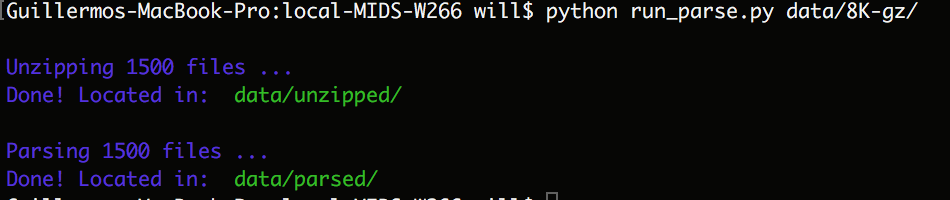
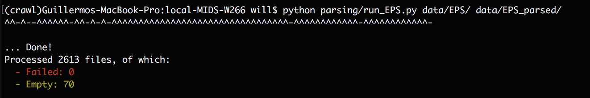

## Sample usage

### Document parsing

Run `$ python run_parse <PATH_TO_ZIPPED_FOLDER> <PATH_TO_OUTPUT_FOLDER>`

### EPS parsing

Run `$ python parsing/run_EPS.py <PATH_TO_INPUT_FOLDER> <PATH_TO_OUTPUT_FOLDER>`

## Further information

### Description

We utilize the data repository from Lee, Surdeanu, MacCartney & Jurafsky, 2014.

The dataset covers S&P 500 companies in the timeframe between 2002 and 2012, and includes the following information:
* SEC 8-K reports for S&P 500 companies  (size: 1.4 GB) - S&P 500 stock returns between 2002 and 2012.
* EPS (size: 17 MB) - quarterly earning surprises for stocks in dataset.
* Price history (size: 100 MB) - price movement of the list of S&P 500 companies.

The raw data consisted of a folder of 1500 zipped files, each corresponding to one of the S&P 500 companies. Each zipped file was a flat text file with all the 8Ks released by that company in a slightly structured manner:
* XML-like tags for enclosing the documents (<DOCUMENT>...<END OF DOCUMENT>)
* Meta-data tags at the head of the document: RELEASE TIME, ITEMS and TEXT

With python we programmatically unzipped the files, split into documents and extracted the following features: Company (or ticker), Timestamp of release, Human-readable release date, Items and Raw text.

From the raw text of the document we had to perform some cleaning tasks, so as to eliminate a few (~10) empty documents (though to either empty text or corrupt tags). The total parsed documents were approximately 195K.

In addition, we had to parse the EPS from the tables in the HTML source, obtaining the Earnings Per Share for each of the companies in the repository.

