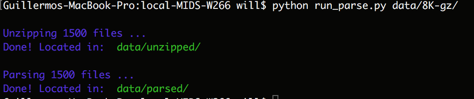
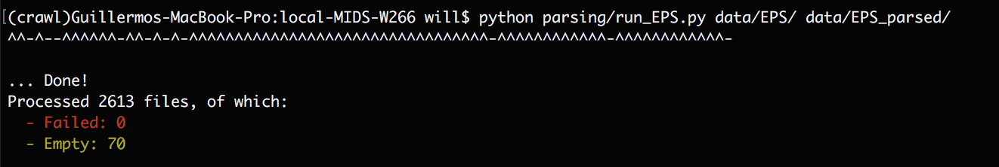

## Sample usage

### Document parsing

Run `$ python run_parse <PATH_TO_ZIPPED_FOLDER> <PATH_TO_OUTPUT_FOLDER>`

### EPS parsing

Run `$ python parsing/run_EPS.py <PATH_TO_INPUT_FOLDER> <PATH_TO_OUTPUT_FOLDER>`

